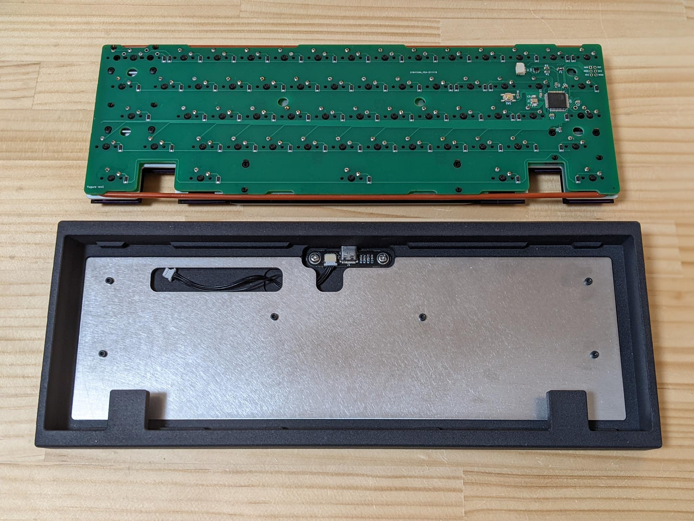

# Yugure

This project is currently primarily for experimental purposes. You are free to use the files in this project according to the license, but I do not recommend that use them as-is

## Feature
- 60% WKL
- O-ring mount (friction fit)
- Single piece tray case
- Designed for SLS 3D printing

## Context
- I've never made a WKL board before and wanted to try it out
- Experimenting with some concepts
 - Unique gasket post location and shape. Testing how they affect the typing feel
 - Design of weight in tray case. Exploring the size and location of weight that are effective in reducing unwanted hollow sound, rather than making the case heavier

## Parts Guide
- Case
  - Use the the files contained in `case` directory
  - `case.step` is the design of the case. Order it from a service that supports SLS 3D printing
  - `weight.dxf` is the design of the weight to be attached to the case. Order 1.5mm thick from laser cutting service
  - Use 6 * 5mm M2 screws to secure the board
- PCB
  - Use the the files contained in `production` directory
  - The files is designed for ordering on JLCPCB. If you are ordering from any other manufacturer, please modify it as necessary
- Plate
  - Use the dxf files contained in `plate` directory
  - Order 1.5mm thick from laser cutting service
- Daughterboard
  - Use the [b-ken-ko's daughterboard](https://github.com/xyzz/b-ken-ko)
  - Use 2 * 3mm M3 screws to secure the board
- O-ring
  - Material: Silicone
  - Durometer(Hardness): 50A
  - AS568 number: 262
  - CS(Thickness): 3.53mm
  - ID(Inner Diameter): 177.39mm
  - OD(Outer Diameter): 184.45mm

## Notes
- This project is experimental and is not designed for serious use like production run
- You may be able to adjust the typing feel by changing the position and size of the mounting post
- There is a mounting post under the blocker, which may be difficult to make with CNC machining
- The PCB design includes the [MX_Alps_Hybrid](https://github.com/ai03-2725/MX_Alps_Hybrid/tree/b2517004a92a2ea354670c713a1530817f9da6df) designed by ai03 as a submodule. It is distributed under the MIT license
